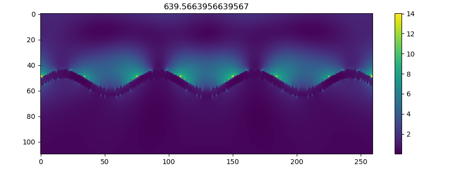

# PlasmonicMEEP

## What this is

This repo consists of a set of scripts for calculation of plasmon resonance/electric field enhancement on different structures.
Scripts are powered by FDTD solver [MEEP](https://github.com/NanoComp/meep).
The scripts are originally built at [Trel725/plasmon-meep](https://github.com/Trel725/plasmon-meep)

## How it works

1. Meep simulates interaction of structure of interest with EM waves, producing arrays describing
   field distribution in space and time.
   Simulation is done twice, for the empty cell (reference run) and for the cell containing structure.
2. The FFT is performed on arrays from previous step, thus tranforming electric fields to frequency domain.
3. Complex values of tranformed fields are squared, producing energiy density at given frequncies.
4. Densities of normal run are normalized by reference run, which directly gives EM field enhancement
   distribution in space and frequency

## How to use it

1. `mpirun -np 2 python3 ./src/perform_fdtd.py` perform step 1, parallel run on 2 processors.
The script includes sinusoidal grating as example, which could be easily modified by modification
of function definition in sinus.py or by defining own geometry.
2. `python3  ./src/calculate_2d_field.py -s 250 -f 1.5 -w 1.5 ./data/data-norm.h5 ./data/data-ref.h5 ./data/freqs.h5`
this script calculates FFT (parallel by default), its square and normalization.
3. `python3 ./src/visualize_freqs.py -t 50 ./data/freqs.h5` visualize the calculated field enhancement arrays.

## How it looks



## Questions

In case of any questions, please, firstly have a look at the issues (including closed). If there are no answer there, feel free to open new one.

## Usage on the compute cluster ARA (FSU Jena)

To make this program easy to use on ARA, I provide a conda environment. To use it, copy (or soft-link) the `.condarc` (conda configuration) [file](./.condarc) to your home directory by running the following command. **Be careful:** If you have a `.condarc` already, it will be overwritten.

```bash
cp .condarc ~/.condarc
```

Now, load the proper Python module, activate the conda environment and you should be
ready to calculate away.

```bash
# This is optional, but good practice, especially when you have some other conda
# instance running.
module purge

# Now you load the Python 3.8 installation. It automatically comes with conda.
module load tools/python/3.8

# If it's the first time you use conda on ARA, you should initialise conda like so:
conda init bash

# Now activate the conda environment that gives you MEEP.
# It comes with MPI for parallel usage.
conda activate pmeep
```

Now, you're able to rock away. To test that you actually have the correct python and MEEP
installed, you can run the following:

```bash
$ which python3
/beegfs/lu27wil/apps/conda-envs/pmeep/bin/python3

$ python3 -c "import meep; print(meep.__version__)"
Using MPI version 3.1, 1 processes
1.16.1
```

## Notes

The [multiviewer.py](./src/multiviewer.py) module is taken and modified
from [Datacamp](https://www.datacamp.com/community/tutorials/matplotlib-3d-volumetric-data).
